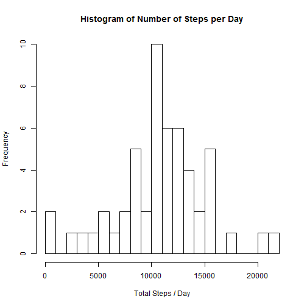
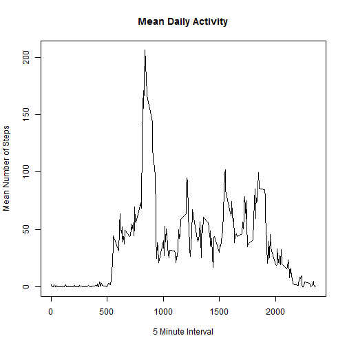
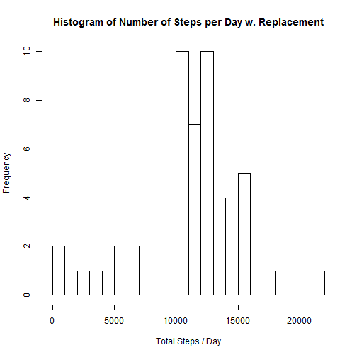
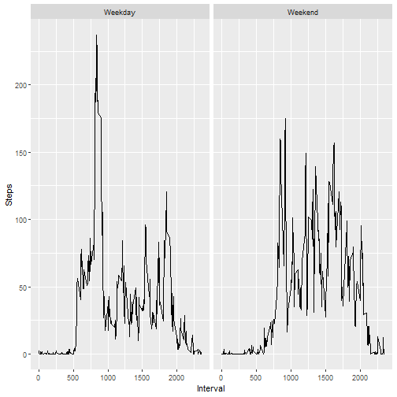

#Marc Reitz
##Reproducible Research 
###Course Project 1

####Introduction:

It is now possible to collect a large amount of data about personal movement using activity monitoring devices such as a Fitbit, Nike Fuelband, or Jawbone Up. These type of devices are part of the "quantified self" movement - a group of enthusiasts who take measurements about themselves regularly to improve their health, to find patterns in their behavior, or because they are tech geeks. But these data remain under-utilized both because the raw data are hard to obtain and there is a lack of statistical methods and software for processing and interpreting the data.

This assignment makes use of data from a personal activity monitoring device. This device collects data at 5 minute intervals through out the day. The data consists of two months of data from an anonymous individual collected during the months of October and November, 2012 and include the number of steps taken in 5 minute intervals each day.

####Loading and preprocessing the data

Pull down and unzip the file if this is the first run. Then use read.csv to load the data to a data frame.

```r
if(!file.exists("./Project")) 
{dir.create("./Project")
  
  fileURL <- "https://d396qusza40orc.cloudfront.net/repdata%2Fdata%2Factivity.zip"
  download.file(fileURL, destfile = "./Project/repdata%2Fdata%2Factivity.zip")
  unzip('./Project/repdata%2Fdata%2Factivity.zip' , exdir = 'Project')
}
Data_Set <- read.csv( "./Project/activity.csv")
```

Set the date format.  Then use the dplyr package to assist with creating a column that identifies the day of the week.


```r
library(dplyr, warn.conflicts = FALSE)
Data_Set$date <- as.Date(Data_Set$date, format = "%Y-%m-%d")
Data_Set <- mutate(Data_Set, weekday = weekdays(Data_Set$date))
```


####What is mean total number of steps taken per day?

1. Calculate the total number of steps taken per day


```r
total_steps_per_day <- aggregate(steps ~date, data = Data_Set, sum)
```


2. Make a histogram of the total number of steps taken each day


```r
hist(total_steps_per_day$steps, main = "Histogram of Number of Steps per Day", 
     xlab = "Total Steps / Day", ylab = "Frequency", breaks =20)
```




3. Calculate and report the mean and median of the total number of steps taken per day


```r
mean(total_steps_per_day$steps)
```

```
## [1] 10766.19
```

```r
median(total_steps_per_day$steps)
```

```
## [1] 10765
```

####What is the average daily activity pattern?

1. Make a time series plot (i.e. type = "l") of the 5-minute interval (x-axis) and the average number of steps taken, averaged across all days (y-axis)


```r
daily_activity <- aggregate(steps ~ interval, data = Data_Set, mean)
plot(daily_activity$interval , daily_activity$steps, 
     main = "Mean Daily Activity",
     xlab = "5 Minute Interval",
     ylab = "Mean Number of Steps", 
     type = "l")
```




2. Which 5-minute interval, on average across all the days in the dataset, contains the maximum number of steps?


```r
daily_activity[daily_activity$steps == max(daily_activity$steps), ]
```

```
##     interval    steps
## 104      835 206.1698
```

####Imputing missing values

1. Calculate and report the total number of missing values in the dataset (i.e. the total number of rows with NAs)

Answer:
True = NA
False = value available


```r
table(is.na(Data_Set$steps))
```

```
## 
## FALSE  TRUE 
## 15264  2304
```

2. Devise a strategy for filling in all of the missing values in the dataset. The strategy does not need to be sophisticated. For example, you could use the mean/median for that day, or the mean for that 5-minute interval, etc.

Answer:  Calculated the average steps taken on any given (day of the week:interval) combination.


```r
steps_per_interval <- aggregate(steps ~ weekday+interval, data = Data_Set, mean)
steps_per_interval$steps <- round(steps_per_interval$steps)
```


3. Create a new dataset that is equal to the original dataset but with the missing data filled in.

Answer:  Created a new data set (Data_Set2) from the base data set by joining the previous calculation to the table.  Then created a new column (called "steps", which was available because the previous steps columns were renamed steps.x and steps.y when merged)


```r
Data_Set2 <- merge(x = Data_Set, y= steps_per_interval, by = c("weekday", "interval"), all = TRUE)
Data_Set2 <- mutate(Data_Set2, 
                   steps = if_else(is.na(Data_Set2$steps.x), 
                                   as.numeric(Data_Set2$steps.y),
                                   as.numeric(Data_Set2$steps.x)
                   )
)
```


4. Make a histogram of the total number of steps taken each day and Calculate and report the mean and median total number of steps taken per day. Do these values differ from the estimates from the first part of the assignment? What is the impact of imputing missing data on the estimates of the total daily number of steps?


```r
total_steps_per_day_w_repl <- aggregate(steps ~date, data = Data_Set2, sum)
hist(total_steps_per_day_w_repl$steps, main = "Histogram of Number of Steps per Day w. Replacement", 
     xlab = "Total Steps / Day", ylab = "Frequency", breaks =20)
```



```r
mean_wo <- mean(total_steps_per_day$steps) 
mean_with <- mean(total_steps_per_day_w_repl$steps)
median_wo <- median(total_steps_per_day$steps)
median_with <- median(total_steps_per_day_w_repl$steps)

r<- data.frame(mean = c( mean_with, mean_wo), median = c(median_with, median_wo))
row.names(r) <- c("With Replacement", "w/o Replacement")

r
```

```
##                      mean median
## With Replacement 10821.10  11015
## w/o Replacement  10766.19  10765
```


####Are there differences in activity patterns between weekdays and weekends?

1.  Create a new factor variable in the dataset with two levels - "weekday" and "weekend" indicating whether a given date is a weekday or weekend day.


```r
Data_Set2 <- mutate(Data_Set2, weekday_or_weekend = 
                     if_else( Data_Set2$weekday %in% c("Sunday", "Saturday"), c("Weekend"), c("Weekday")))

table(Data_Set2$weekday_or_weekend)
```

```
## 
## Weekday Weekend 
##   12960    4608
```

2. Make a panel plot containing a time series plot (i.e. type = "l") of the 5-minute interval (x-axis) and the average number of steps taken, averaged across all weekday days or weekend days (y-axis). 


```r
library(ggplot2)
weekend_plot <- aggregate(steps ~ weekday_or_weekend+interval, data = Data_Set2, mean)

ggplot( weekend_plot, aes(interval, steps)) + geom_line() + facet_grid(.~weekday_or_weekend) + labs(x="Interval", y = "Steps")
```




